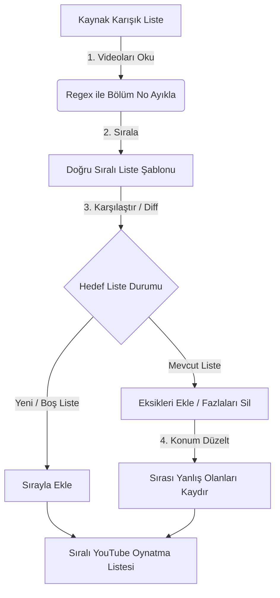

# yt-playlist-sorter (YouTube Oynatma Listesi Sıralayıcı ve Eşitleyici)

Bu proje, YouTube üzerinde başka bir kullanıcıya ait olan ve bölümleri düzensiz/karışık sıralanmış oynatma listelerini (playlist) analiz ederek, kendi hesabınızda **bölüm numarasına göre doğru sırayla** senkronize bir oynatma listesi oluşturmanızı ve yönetmenizi sağlar.

Script her çalıştığında listeyi kontrol eder; yeni eklenen bölümleri ekler, sırası bozulanları düzeltir ve kotayı koruyacak şekilde minimum API çağrısı ile listeyi güncel tutar.

---

## 🌟 Projenin Amacı

YouTube'daki bazı kanal sahipleri dizi veya video serilerini oynatma listelerine yükleme tarihlerine göre eklediklerinden veya sırayı yanlışlıkla karıştırdıklarından bölümler düzensiz olabilmektedir. Bu proje, bu videoları **bölüm numaralarına göre otomatik olarak doğru sıraya (1, 2, 3...)** dizerek kendi hesabınızda düzenli bir oynatma listesi oluşturur.

### 🔍 Çözdüğü Problemler
1. **Manuel Arama Derdi:** Karışık listelerde sonraki bölümü aramak yerine ardışık bölümleri otomatik oynatma (Autoplay) konforu sağlar.
2. **Zaman Tasarrufu:** Elle düzgün sıralı bir oynatma listesi oluşturup tek tek videoları eklemekle uğraşmazsınız.
3. **Akıllı Senkronizasyon:** Kaynak listeye yeni bölümler eklendiğinde veya silindiğinde script sadece değişen kısımları günceller.
4. **Kota Tasarrufu:** Tüm listeyi silip baştan yüklemek yerine sadece sırası bozulanları kaydırarak veya eksik olanları ekleyerek YouTube API kotalarını korur.

### ⚙️ Çalışma Mantığı



1. **Analiz:** Kaynak listedeki tüm videolar çekilir ve başlıklarındaki bölüm numaraları (Örn: *29. Bölüm*, *Bölüm 2* vb.) regex ile sayısal değerlere dönüştürülür.
2. **Sıralama:** Videolar bölüm numarasına göre küçükten büyüğe sıralanır.
3. **Eşitleme (Diff):** Kendi hesabınızdaki hedef oynatma listesinin mevcut durumu ile sıralı şablon karşılaştırılır; eksikler eklenir, fazlalıklar silinir ve konumu yanlış olanlar API ile doğru sıraya kaydırılır.


---

## Kurulum ve Gereksinimler

### 1. Google Cloud Projesi ve API Kurulumu (Ücretsiz)

Scriptin YouTube hesabınıza erişip oynatma listesi oluşturabilmesi ve güncelleyebilmesi için Google Cloud üzerinden bir **OAuth 2.0 Kimlik Bilgisi (Credentials)** almanız gerekmektedir. Bu işlem tamamen ücretsizdir.

#### Adım Adım GCP Kurulumu:
1. **Google Cloud Console**'a ([console.cloud.google.com](https://console.cloud.google.com/)) YouTube kanalınızın bağlı olduğu Google hesabıyla giriş yapın.
2. Sol üst köşedeki proje seçicide bulunan **"New Project" (Yeni Proje)** butonuna tıklayarak yeni bir proje oluşturun (Örn: `youtube-playlist-sorter`).
3. Üstteki arama çubuğuna **"YouTube Data API v3"** yazın, çıkan sonuca tıklayın ve **"Enable" (Etkinleştir)** butonuna basın.
4. Sol menüden **"OAuth consent screen" (OAuth rıza ekranı)** sekmesine gidin:
   * **User Type (Kullanıcı Türü):** **External (Harici)** seçin ve "Create" butonuna tıklayın.
   * **App Information (Uygulama Bilgileri):** Uygulama adı (Örn: `Playlist Sorter`) ve e-posta adreslerinizi girip kaydedin. Diğer alanları boş bırakabilirsiniz.
   * **Test Users (Test Kullanıcıları):** Bu adım çok önemlidir. **"Add Users"** butonuna tıklayarak kendi Gmail adresinizi (YouTube kanalınızın bağlı olduğu e-posta) ekleyin. Uygulama test modunda olacağı için sadece bu listedeki kullanıcılar giriş yapabilir.
5. Sol menüden **"Credentials" (Kimlik Bilgileri)** sekmesine gidin:
   * **"Create Credentials"** -> **"OAuth client ID"** seçeneğine tıklayın.
   * **Application type (Uygulama türü):** **Desktop app (Masaüstü uygulaması)** seçin.
   * Bir isim (Örn: `Desktop Client`) belirleyip "Create" butonuna basın.
6. Oluşan istemci kimliğinin (OAuth Client) sağ tarafındaki **İndirme (Download)** ikonuna tıklayarak JSON dosyasını bilgisayarınıza indirin.
7. İndirdiğiniz bu dosyanın adını **`credentials.json`** olarak değiştirin ve projenin ana klasörüne (bu `README.md` dosyasının yanına) kopyalayın.

---

## Çalıştırma Hazırlığı

### 2. Python ve Kütüphanelerin Kurulumu

Bilgisayarınızda Python 3.x sürümünün kurulu olduğundan emin olun. Ardından projenin ana dizininde terminali açarak gerekli kütüphaneleri kurun:

```bash
pip install -r requirements.txt
```

*(Not: Gerekli kütüphaneler: `google-api-python-client`, `google-auth-oauthlib`, `google-auth-httplib2`)*

---

## Kullanım

Script yazıldıktan sonra aşağıdaki parametreler ile çalıştırılacaktır:
* **Kaynak Liste (Source Playlist ID):** Düzeltilmek istenen oynatma listesinin URL'sindeki `list=PL...` parametresi.
* **Hedef Liste Adı:** Kendi hesabınızda oluşturulmasını istediğiniz oynatma listesinin başlığı.

*İlk çalıştırmada script otomatik olarak tarayıcınızda bir pencere açarak YouTube hesabınıza erişim izni isteyecektir. Onay verdikten sonra yetkilendirme bilgileri yerelde `token.json` dosyasına kaydedilir ve sonraki çalıştırmalarda tekrar giriş yapmanız gerekmez.*

---

## Sık Karşılaşılan Sorunlar ve Çözümleri

### 1. "YouTube Data API v3 has not been used in project..." Hatası (403 Forbidden)
* **Neden:** Google Cloud Console'da oluşturduğunuz projede YouTube Data API v3'ü etkinleştirmeyi unuttunuz veya kimlik bilgilerinizi farklı bir projeden indirdiniz.
* **Çözüm:** Hata mesajında yer alan linke tıklayarak projenizde YouTube Data API v3'ü **Etkinleştirin (Enable)**. Birkaç dakika bekleyip scripti yeniden çalıştırın.

### 2. "The playlist identified with the request's playlistId parameter cannot be found" Hatası (404 Not Found)
* **Neden:** YouTube sunucularında yeni bir oynatma listesi oluşturulduğunda verilerin tüm sunuculara dağıtılması (yansıma gecikmesi/eventual consistency) birkaç saniye sürebilir. Bu esnada liste henüz var olmamış gibi görünebilir.
* **Çözüm:** Script bu durumu otomatik olarak yönetir. Yeni oluşturulan listeler için veri gecikmesi süresince eklemeleri bekletir ve 404 hatalarını yoksayarak boş liste kabul eder. Hata devam ederse 3-5 saniye sonra tekrar deneyin.

### 3. Loglama ve Hata Takibi
Tüm işlemler, başarı bildirimleri ve olası API hataları projenin ana dizininde bulunan **`playlist_sync.log`** dosyasına detaylı olarak kaydedilmektedir. Sorun yaşamanız durumunda bu log dosyasını inceleyebilirsiniz.

